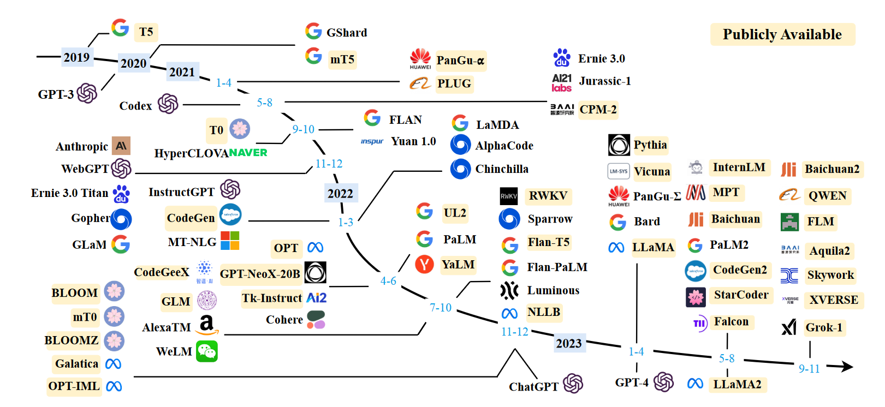

# Llms学习笔记  
# Language Model

​		语言模型是对一组词元序列（tokens）的概率分布的一种表示方法，假设我们有一个词元集的词汇表 $V$ 。语言模型p为每个词元序列 $x_{1},...,x_{L}$ ∈ $V$ 分配一个概率（介于0和1之间的数字）

$$
p(x_1, \dots, x_L)
$$

​		语言模型也可以采用生成形式，即根据输入的词元来生成下一个词，其中下一词的选取根据目前所给的词通过神经网路计算从而采用概率最高的一词。  

$$
prompt→completion
$$

​		例如根据提示词生成：

$$
sky;blue;grass→green
$$

# Large language Models

​		语言模型是根据概率论等生成新词语，2018年，随着Transformer神经网络构架的发现，大量提升了训练语言模型神经网络的样本数量，大语言模型处理自然语言的能力得到大幅度提升，正式进入大模型时代，大模型层出不穷。  
​		目前市面上常见的大模型有：

		现阶段大模型分为开源模型以及闭源模型，其中闭源模型较为知名的有Chat-GPT系列、claude系列。开源模型有llama系列、GLM系列等。

# LLm的特点

### 涌现能力
​		LLM与PLM最显著的区别就是涌现能力，其主要表现为下面三个：
#### 上下文学习
​		理解上下文从而生成新文本
### 指令微调
​		根据后续新指令以及训练执行新任务
### 推理
​		在问答中答案逐级精确

# 模型架构
​		简而言之大模型是通过对输入提示词（prompt）的处理从而生成结果（completion）。对于语言模型来说，最初的起源来自于Transformer模型，这个模型是编码-解码端 （Encoder-Decoder）的架构。但是当前对于语言模型的分类，将语言模型分为三个类型：编码端（Encoder-Only），解码端（Decoder-Only）和编码-解码端（Encoder-Decoder）

其中，分词（tokenization）和模型构架（基本为Transformer结构）为主要讨论内容。

### 分词
​		NPL中，token指文本序列中最小一个单元，一个序列一般被分为数个tokens进行处理

>NPL (natural language processing)自然语言处理技术，则是将人类语言转换成计算机能理解的符号或将机器语言转换成人可以理解的语言，是计算机科学领域与人工智能领域中的一个重要方向

​		分词方式有很多，如基于空格的分词方式、Byte pair encoding，将字节对编码（BPE）算法应用于数据压缩领域，用于生成其中一个最常用的分词器、基于目标函数的分词模型可以适应更好分词场景，即Unigram model等。

## 架构
## Transformer
### 整体结构

>[参考](https://zhuanlan.zhihu.com/p/338817680)

​		首先介绍 Transformer 的整体结构，下图是 Transformer 用于中英文翻译的整体结构

​		由 **Encoder** 和 **Decoder** 两个部分组成，Encoder 和 Decoder 都包含 **6** 个 block。Transformer 的工作流程大体如下：

		 >1.首先，获取输入句子的每一个单词的表示向量 X，X由单词的Embedding（Embedding就是从原始数据提取出来的Feature） 和单词位置的 Embedding 相加得到。

	

​		2.将得到的单词表示向量矩阵传入 Encoder 中，经过 6 个 Encoder block 后可以得到句子所有单词的编码信息矩阵C。

​		3.将 Encoder 输出的编码信息矩阵 C传递到 Decoder 中，Decoder 依次会根据当前翻译过的单词 1~ i 翻译下一个单词 i+1，如下图所示。在使用的过程中，翻译到单词 i+1 的时候需要通过 **Mask** (掩盖) 操作遮盖住 i+1 之后的单词。

### 输入

​		输入的组成主要为词元的Embedding和词元位置的Embedding，其中单词的Embedding获取较为容易，可以利用WordsVec等方法预训练获得，关于位置的Embedding，Transformer 中使用位置 Embedding 保存单词在序列中的相对或绝对位置。

>Embedding: 简单来说，embedding就是用一个低维的向量表示一个物体，可以是一个词，或是一个商品，或是一个电影等等。这个embedding向量的性质是能使距离相近的向量对应的物体有相近的含义，比如 Embedding(复仇者联盟)和Embedding(钢铁侠)之间的距离就会很接近，但 Embedding(复仇者联盟)和Embedding(乱世佳人)的距离就会远一些。　

### 注意力机制（Self-Attention）

Self-Attention（自注意力机制）是Transformer中的重点机制，上图为Transformer的结构图，左边为编码器，右边为解码器，图中花圈的Mitu-Head Attention是由多个Self-Attention组成的。

**本质地讲，自注意力机制是:通过某种运算来直接计算得到句子在编码过程中每个位置上的注意力权重；然后再以权重和的形式来计算得到整个句子的隐含向量表示**

#### Self-Attention结构

​		上图为Self-Attention结构示意图，计算时需要用到QKV，在实际中，Self-Attention 接收的是输入(单词的表示向量x组成的矩阵X) 或者上一个 Encoder block 的输出。而**Q,K,V**正是通过 Self-Attention 的输入进行线性变换得到的。在输入后，经过矩阵变换得到每个词元的QKV，之后用作输入。

>查询（Q）： 代表模型当前关注的项目。 在序列中，查询就像对特定元素提出问题。 键（K）： 代表序列中模型可能关注的所有项目。 键是查询用来比较的对象，以确定应该给予多少注意力。 值（V）： 每个键都与一个值相关联。 一旦模型确定了哪些键是重要的（基于查询），就会使用相应的值来构建输出.
>
>[QKV介绍](https://blog.csdn.net/2301_79342058/article/details/134820283)

​	在QKV输入后，通过以下公式计算输出，经过softmax矩阵计算后可以得到每一个词与其他单词的attention系数。然后与V矩阵进行MatMul。然后我们得到最终输出，即值的加权和，其中权重由每个键与查询匹配的程度决定。

**自注意力机制的缺陷是：模型在对当前位置的信息进行编码时，会过度的将注意力集中于自身的位置， 因此作者提出了通过多头注意力机制来解决这一问题。**

#### Muti-Head Attention结构

Muti-Head Attention是由多个Self-Attention组成，

多头注意力机制是将词元向量输入到h个不同的Self-Attention中，每个Self-Attention输出的注意力矩阵，将h个注意力矩阵拼接到一起传入一个Linear层得到最后的输出。

#### Add & Norm与Feed Forward

​		**Add**指 **X**+MultiHeadAttention(**X**)，是一种残差连接，通常用于解决多层网络训练的问题，使模型卷的更深，因为模型要重复N次，Add操作充分考虑了模型复杂度，抵抗模型深度所导致输入信号的衰减，可以让网络只关注当前差异的部分。**Norm**指 Layer Normalization，通常用于 RNN 结构，Layer Normalization 会将每一层神经元的输入都转成均值方差都一样的，这样可以加快收敛。***二者结合使模型训练更加稳定***

**Feedforward**是一个前馈神经网络，引入**ReLu**激活函数，增加模型的非线性。这使得模型能够***学习到更加复杂的模式和关系***。

### Encoder组成

​		上述几个单元组合即组成一个Encoder block，多个Encoder block叠加组成Encoder，输入文字矩阵经过Encoder block后输出一个编码信息矩阵，后续用于Decoder中。

### Decoder组成

​		上图为Decoder block组成，由两个Muti-Head Attention和一个Feed Forward组成，其中第一个Muti-Head Attention采用了Masked的操作，其中Mask的作用是保证翻译都顺序，在翻译完第i个词之后才可以翻译第i+1个，防止提前知道之后的信息，类似Teaching force。

>teacher-forcing： 在训练网络过程中，每次不使用上一个state的输出作为下一个state的输入，而是直接使用训练数据的标准答案(ground truth)的对应上一项作为下一个state的输入。训练迭代过程早期的RNN预测能力非常弱，几乎不能给出好的生成结果。如果某一个unit产生了垃圾结果，必然会影响后面一片unit的学习。错误结果会导致后续的学习都受到不好的影响，导致学习速度变慢，难以收敛。teacher forcing最初的motivation就是解决这个问题的

​		具体实现原理如下，在预测下一个词之前掩盖住下一词的信息，发现下一个词之前只能用下一个词之前的信息。

​		第二个Muti-Head Attention是使用Encoder输出的信息结合上一个Decoder输出的矩阵计算。

​		Softmax来预测下一个单词.

[可视化实现过程](https://poloclub.github.io/transformer-explainer/)

## 大模型训练

​		**预训练**（Pre-training）、**SFT**（有监督的微调，Supervised-Finetuning）以及**RLHF**（基于人类反馈的强化学习，Reinforcement Learning from Human Feedback）

## 预训练

​		预训练是开发大模型算力需求成本最高的阶段，开发模型的99%的算力消耗在此阶段，训练数据集一般以亿（billion）计算。下面说明以Transformer架构进行预训练的具体例子，这里以BERT（Bidirectional Encoder Representations from Transformers）模型为例。

> BERT（Bidirectional Encoder Representations from Transformers）:BERT 是一种基于 Transformer 架构的双向语言表示模型。它通过对海量文本数据的预训练，学习得到丰富的上下文表示，然后在下游任务上进行微调，实现极高的性能。与传统的单向语言模型相比，BERT 的核心优势在于：
>
> **双向性**：BERT通过使用Transformer的编码器结构，BERT 能够同时从文本的左右两个方向学习上下文信息，使模型能够更好地理解句子中的每个词的语义。
>
> **预训练与微调**：通过预训练任务（如 Masked Language Model 和 Next Sentence Prediction），BERT 可以在多种下游任务上进行快速微调。
>
> 结构：BERT 的结构基于 Transformer 编码器（Encoder）部分。完整的 BERT 模型包括一个词嵌入层、多层的 Transformer 编码器，以及用于特定任务的输出层
>
> 

**数据收集**：使用了英文维基百科（约2500万篇文章，1100亿个词）和书籍语料库BookCorpus（约7000本书，3800万个词）。

**数据预处理**：对数据进行**分词**和**编码**。

**掩码语言模型（MLM）**：随机选择15%的tokens进行掩码，其中80%的时间用`[MASK]`token替换，10%的时间用随机token替换，10%的时间保持不变。

**下一句预测**：在预训练数据中，随机选择50%的句子对作为正样本（实际上是连续的句子），其余50%作为负样本（不连续的句子）。

**训练策略制定**：学习率调度

- **预热**：在前10,000步线性增加学习率。
- **衰减策略**：使用线性衰减策略。

- **梯度累积**：如果显存不足，可以累积梯度。

## SFT（Supervised Finetuning）监督微调

​		监督微调（Supervised Fine-Tuning, SFT）是对已经预训练的模型进行特定任务的训练，以提高其在该任务上的表现。预训练模型通常在大量通用数据上进行训练，学到广泛的语言知识和特征。在SFT过程中，利用特定任务的数据，对模型进行进一步调整，使其更适合该任务。

>[微调实例](https://blog.csdn.net/sunyuhua_keyboard/article/details/140096441)

### **RLHF**：

​		这一步骤可以理解为在前面的学习基础上，引入了人类的反馈来进一步优化模型。

# 计划

学习数据微调方法。

了解现阶段开源大模型特点，构架等。

学习数据集生成收集技巧。

查阅相关论文，了解工作流程。

