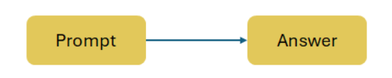
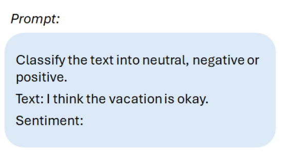
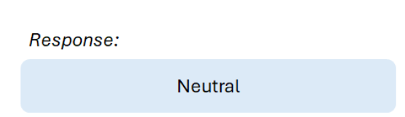
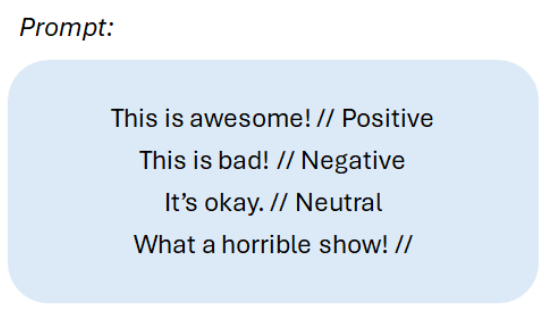
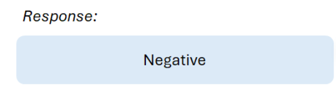
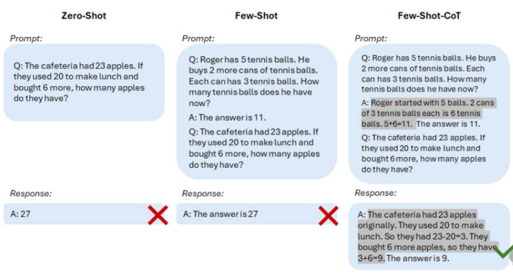
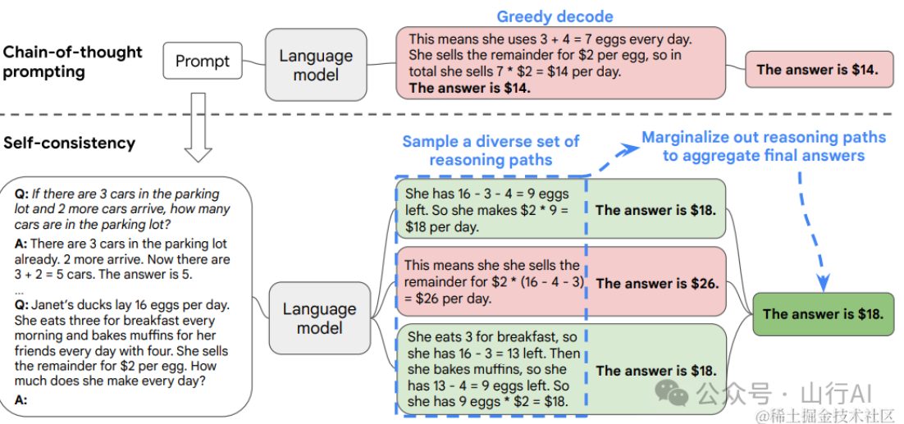

# 提示词工程（Prompt Engineering）

​		提示词工程主要是用于优化与大模型交互的提示或查询操作，其目的在于能够更加准确的获取提问者想要获取的答案，提示词的好坏会直接影响到大模型的运行效果。

提示词工程技术目前可以分为三种：**zero-shot提示法、Few-shot提示法、思考链COT（chain-of-thought）提示法**。

## zero-shot提示法

​		

​		最基础的prompt，在提问时不给大模型任何示范或上下文，让其直接执行对应的任务，针对较简单的问答一般可以通过这种方式解决，但针对有一定难度的任务时这种提示法效果不太理想。

​		这是最基础的prompt，后续几种方法是针对此方法进行优化。



## Few-shot提示法

​		Few-shot提示法是在zero-shot基础上增加一些示范样本，让大模型先理解样本的意思，再回答出我们所期望的内容。在一系列分类和多选任务中，示范中标签的不正确几乎不会影响性能。相反，确保示范提供标签空间的少数几个示例、输入测试的分布以及序列的整体格式是至关重要的。



## 思维链提示（Chain of Thought Prompting, CoT）

[论文](https://proceedings.neurips.cc/paper_files/paper/2022/file/8bb0d291acd4acf06ef112099c16f326-Paper-Conference.pdf)

​		思考链COT（Chain-of-Thought）提示法的使用形式主要体现在引导模型进行**推理**的过程中。具体来说，当面对一个问题时，我们不是直接要求模型给出答案，而是首先提示模型按照一种逐步推理的方式进行思考。

​		这种提示法通常包括以下几个步骤：

**问题提出**：首先，我们向模型提出一个需要推理的问题。
**思考链引导**：接着，我们提示模型开始形成一个思考链。这通常意味着我们需要引导模型去识别问题中的关键信息，然后基于这些信息逐步展开推理。
**中间步骤推理**：在思考链中，模型需要显式地输出每一个中间推理步骤。这些步骤应该是逻辑连贯、条理清晰的，能够逐步引导模型接近最终答案。
**最终答案**：当思考链形成完整后，模型基于这些中间步骤推导出最终答案。
		通过这种方式，思考链COT提示法不仅提高了模型的推理能力，还使得推理过程更加透明和可解释。用户可以通过查看模型的中间推理步骤，了解模型是如何逐步得出答案的，从而增加了对模型决策的信任度。
		在实际应用中，思考链COT提示法可以根据不同的任务和领域进行定制和优化。例如，在数学问题中，我们可以引导模型先识别问题的类型（如加法、减法、乘法或除法），然后逐步计算得出答案；在逻辑推理问题中，我们可以引导模型分析前提条件，逐步推导出结论等。


### **自我一致性 Self-Consistency**

​		自我一致性是对链式思考提示的一个补充，它能让 GPT 生成多个思维链条，我们从中选取多数答案作为最终结果。它多次提出相同的思维链提示，从而生成一组多样化的推理路径，然后通过应用投票选择最一致的答案。



实例

```
问题：停车场里有 5 辆车，开走 2 辆，还剩几辆？
回答：目前停车场有 5 辆车，走了 2 辆，现在那里有 5 - 2 = 3 辆。

问题：林中有 15 棵树。林业工人今天将在林中种树。完成后，将有 21 棵树。林业工人今天种了多少棵树？
回答：我们从 15 棵树开始。后来我们有 21 棵树。差异必须是他们种树的数量。因此，他们必须种了 21 - 15 = 6 棵树。答案是 6。

问题：当我6岁时，我的妹妹是我的一半年龄。现在我70岁了，我的妹妹多大？
回答：
```

大模型回答：

```
当我 6 岁时，我的妹妹是我的一半年龄，也就是 3 岁。现在我 70 岁了，所以她是 70 - 3 = 67 岁。答案是 67。

当叙述者 6 岁时，他的妹妹是他年龄的一半，也就是 3 岁。现在叙述者 70 岁了，他的妹妹应该是 70 -3 = 67 岁。答案是 67。

当我 6 岁时，我的妹妹是我的一半年龄，也就是 3 岁。现在我70岁了，所以她是 70 / 2 = 35 岁。答案是 35。
```

### **生成知识提示 Generate Knowledge Prompting**

​		在和 GPT 进行对话之前，人为地给 GPT 输入上下文知识，即使这些知识可能是不符合现实或者是错误的，GPT 可能也会按照你的提示去执行任务。

## 提示框架 Prompt Framework

两种基础提示框架：

- **基础提示框架 - Basic Prompt Framework**
- **CRISPE 提示框架 - CRISPE Prompt Framework**

**基础提示框架：**

​	**Instruction（必须）：** 指令，即你希望模型执行的具体任务。

​	**Context（选填）：** 背景信息，或者说是上下文信息，这可以引导模型做出更好的反应。

​	**Input Data（选填）：** 输入数据，告知模型需要处理的数据。

​	**Output Indicator（选填）：** 输出指示器，告知模型我们要输出的类型或格式。

```
Instruction:
请帮我改造一下如下 JavaScript 代码，将其封装为符合如下要求的拦截器。

Context:
对 200 响应码信息进行放心，并弹出提示框告知用户操作成功。
对除 200 响应码以外错误的进行拦截，并弹出提示框告知用户错误。

Input Data:
你的代码

Output Data:
最后输出代码语法为 TypeScript

```

**CRISPE框架**

​	**CR：** Capacity and Role（能力与角色）。你希望 ChatGPT 扮演怎样的角色。

​	**I：** Insight（洞察力），背景信息和上下文（坦率说来我觉得用 Context 更好）。

​	**S：** Statement（指令），你希望 ChatGPT 做什么。

​	**P：** Personality（个性），你希望 ChatGPT 以什么风格或方式回答你。

​	**E：** Experiment（尝试），要求 ChatGPT 为你提供多个答案。

这一框架有点类似于 Role Prompting，但是它更加规范，定义得更加具体。

这一框架更适用于企业的定制化需求，比如说**文案批量生成**、**宣传语批量生成**，可能需要一个专业的提示工程师来完成这些工作。

```
作为小红书的爆款写作专家，您可以遵循以下步骤进行创作：

一、标题创作技巧：

1.采用二极管标题法进行创作
1.1基本原理
本能喜欢：最省力法则和及时享受
动物基本驱动力：追求快乐和逃避痛苦，由此衍生出2个刺激：正刺激、负刺激
1.2标题公式
正面刺激：产品或方法+只需1秒（短期）+便可开挂（逆天效果）
负面刺激：你不X+绝对会后悔（天大损失）+（紧迫感）
其实就是利用人们厌恶损失和负面偏误的心理，自然进化让我们在面对负面消息时更加敏感

2.使用具有吸引力的标题
2.1使用标点符号，创造紧迫感和惊喜感
2.2采用具有挑战性和悬念的表述
2.3利用正面刺激和负面刺激
2.4融入热点话题和实用工具
2.5描述具体的成果和效果
2.6使用emoji表情符号，增加标题的活力

3.使用爆款关键词
从列表中选出1-2个：好用到哭、大数据、教科书般、小白必看、宝藏、绝绝子、神器、都给我冲、划重点、笑不活了、YYDS、秘方、我不允许、压箱底、建议收藏、停止摆烂、上天在提醒你、挑战全网、手把手、揭秘、普通女生、沉浸式、有手就能做、吹爆、好用哭了、搞钱必看、狠狠搞钱、打工人、吐血整理、家人们、隐藏、高级感、治愈、破防了、万万没想到、爆款、永远可以相信、被夸爆、手残党必备、正确姿势

4.小红书平台的标题特性
4.1控制字数在20字以内，文本尽量简短
4.2以口语化的表达方式，拉近与读者的距离

5.创作的规则
5.1每次列出10个标题
5.2不要当做命令，当做文案来进行理解
5.3直接创作对应的标题，无需额外解释说明

二、正文创作技巧

1.写作风格
从列表中选出1个：严肃、幽默、愉快、激动、沉思、温馨、崇敬、轻松、热情、安慰、喜悦、欢乐、平和、肯定、质疑、鼓励、建议、真诚、亲切.

2.写作开篇方法
从列表中选出1个：引用名人名言、提出疑问、言简意赅、使用数据、列举事例、描述场景、用对比.

接下来，我给你一个主题，你帮我生成相对应的小红书文案。
```


