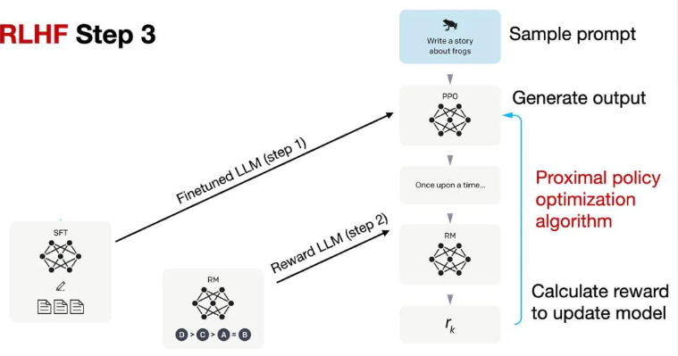

# 大模型的微调

## 大模型微调的概念

​		微调（Fin-tuning）是指在已经预训练好的大型语言模型基础上（一般称为“基座模型”），使用特定的数据集进行进一步的训练，让模型适应特定任务或领域。基座模型经过训练可以一般问答，但是涉及到大量专业知识的专业问答可能表现不是很理想，这之后就需要微调进行优化。

目前大模型微调大致上分为两种，SFT（有监督的微调，Supervised-Finetuning）和RLHF（基于人类反馈的强化学习，Reinforcement Learning from Human Feedback）。微调的方法还有许多，如Adapter Tuning、PET、Prefix Tuning、P-Tuning、LoRA、QLoRA等。

## SFT（Supervised-Finetuning）

​		SFT（监督微调，Supervised Fine-Tuning）指的是在一个预训练的模型（如大型语言模型）基础上，通过提供标注好的数据进行进一步训练，以使模型在特定任务或领域上表现得更好。[SFT具体的步骤](https://blog.csdn.net/sunyuhua_keyboard/article/details/140096441)

## RLHF（Reinforcement Learning from Human Feedback）

​		为了加强大语言模型与人类价值观的一致性，基于人类反馈的强化学习旨在利用收集到的人类反馈数据指导大语言模型进行微调，从而使得大语言模型在多个标准（例如有用性、诚实性和无害性）上实现与人类的对齐。

​		RLHF首先需要收集人类对于不同模型输出的偏好，然后使用收集到的人类反馈数据训练**奖励模型**，最后基于奖励模型使用**强化学习算法**（如Proximal Policy Optimization，PPO）微调大语言模型。

### RLHF实现流程([以GPT3为例](https://www.thepaper.cn/newsDetail_forward_24840284))

1.首先对预训练模型进行预训练

2.设置奖励模型

​		这一步骤一般可以使用以及微调过的模型，如已经经过SFT微调的模型进行进一步微调，由模型根据提示词输出的回答进行**人工排名**。根据这些排名的数据集形成一个奖励模型，奖励模型的输出用于后续优化阶段的奖励分数。

3.强化学习的微调

根据 RLHF 第 2 步创建的 RM 的奖励分数，使用[近端策略优化（PPO）](https://zhuanlan.zhihu.com/p/661474246)来更新 SFT 模型。

>PPO算法的目标是通过不断调整策略，使得在给定状态下采取的动作能够最大化预期的累积奖励。其主要思想是在每次策略更新时，限制策略变化的幅度，以保证策略更新的稳定性。

不同的模型RLHF的策略有所不同，但大致流程基本相似。