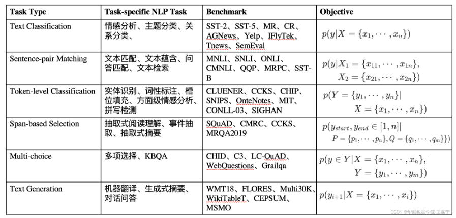
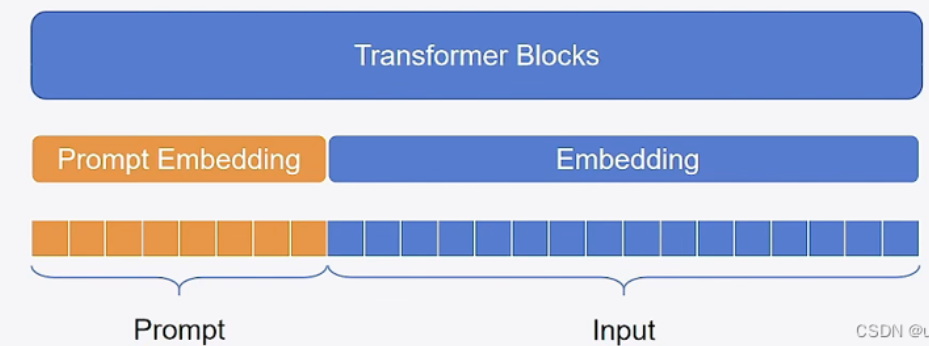
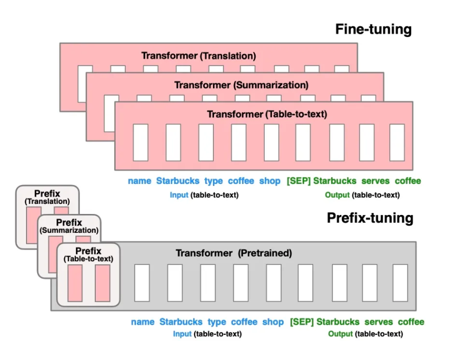
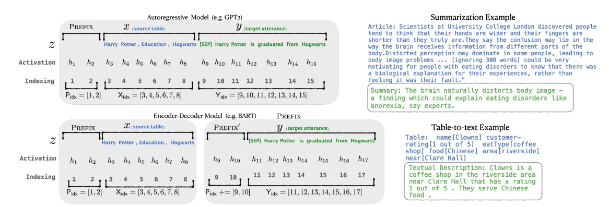
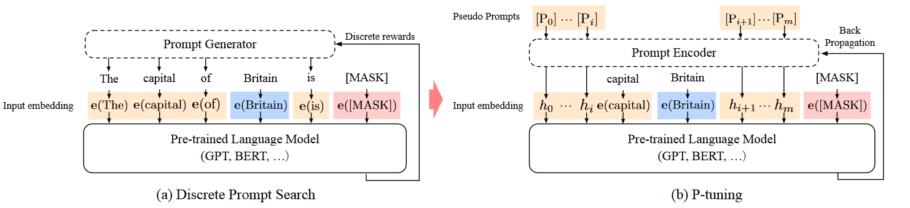
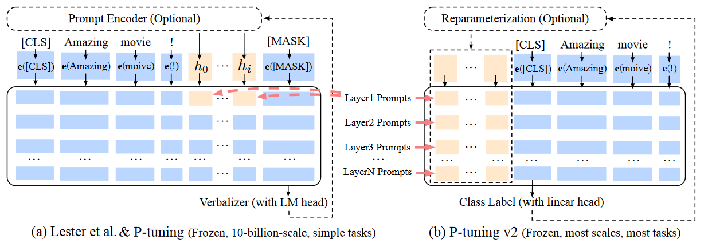
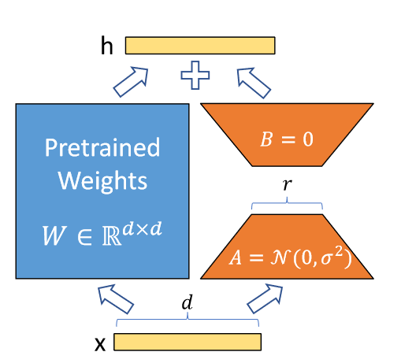
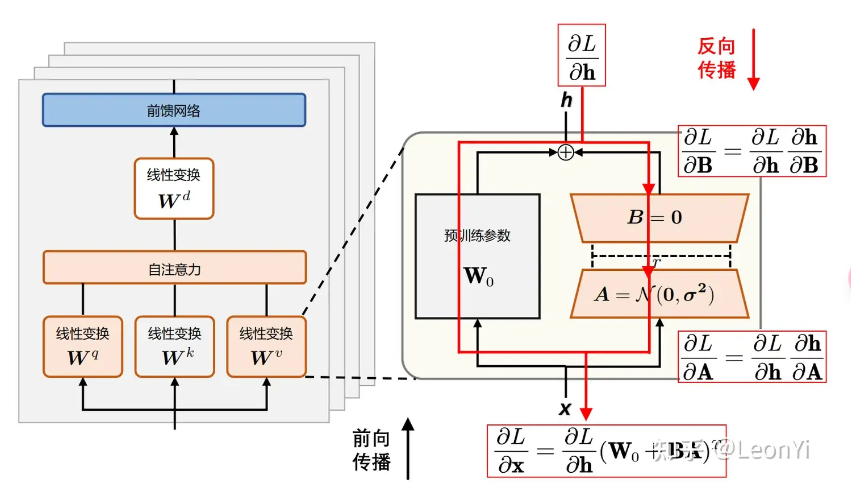
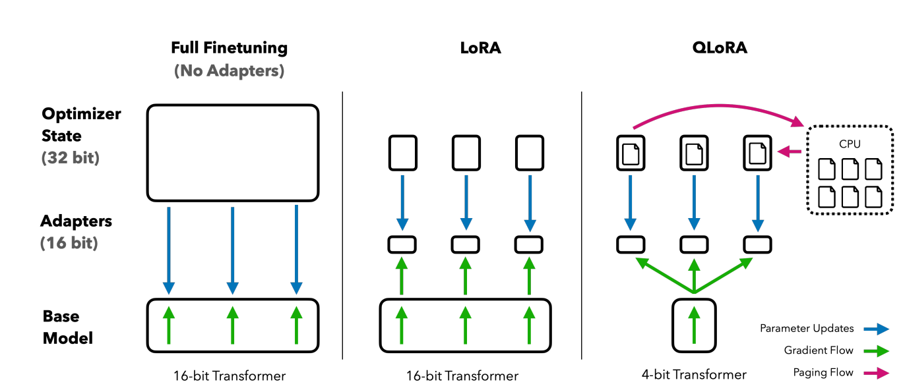

# 大模型的微调

## 大模型微调的概念

​		微调（Fin-tuning）是指在已经预训练好的大型语言模型基础上（一般称为“基座模型”），使用特定的数据集进行进一步的训练，让模型适应特定任务或领域。基座模型经过训练可以一般问答，但是涉及到大量专业知识的专业问答可能表现不是很理想，这之后就需要微调进行优化。

目前大模型微调大致上分为两种，SFT（有监督的微调，Supervised-Finetuning）和RLHF（基于人类反馈的强化学习，Reinforcement Learning from Human Feedback）。微调的方法还有许多，如Adapter Tuning、PET、Prefix Tuning、P-Tuning、LoRA、QLoRA等。

## SFT（Supervised-Finetuning）

​		SFT（监督微调，Supervised Fine-Tuning）指的是在一个预训练的模型（如大型语言模型）基础上，通过提供标注好的数据进行进一步训练，以使模型在特定任务或领域上表现得更好。[SFT具体的步骤](https://blog.csdn.net/sunyuhua_keyboard/article/details/140096441)

## RLHF（Reinforcement Learning from Human Feedback）

​		为了加强大语言模型与人类价值观的一致性，基于人类反馈的强化学习旨在利用收集到的人类反馈数据指导大语言模型进行微调，从而使得大语言模型在多个标准（例如有用性、诚实性和无害性）上实现与人类的对齐。

​		RLHF首先需要收集人类对于不同模型输出的偏好，然后使用收集到的人类反馈数据训练**奖励模型**，最后基于奖励模型使用**强化学习算法**（如Proximal Policy Optimization，PPO）微调大语言模型。

### RLHF实现流程([以GPT3为例](https://www.thepaper.cn/newsDetail_forward_24840284))

1.首先对预训练模型进行预训练

2.设置奖励模型

​		这一步骤一般可以使用以及微调过的模型，如已经经过SFT微调的模型进行进一步微调，由模型根据提示词输出的回答进行**人工排名**。根据这些排名的数据集形成一个奖励模型，奖励模型的输出用于后续优化阶段的奖励分数。

3.强化学习的微调

根据 RLHF 第 2 步创建的 RM 的奖励分数，使用[近端策略优化（PPO）](https://zhuanlan.zhihu.com/p/661474246)来更新 SFT 模型。

>PPO算法的目标是通过不断调整策略，使得在给定状态下采取的动作能够最大化预期的累积奖励。其主要思想是在每次策略更新时，限制策略变化的幅度，以保证策略更新的稳定性。

不同的模型RLHF的策略有所不同，但大致流程基本相似。

## [Prompt tuning](https://github.com/THUDM/P-tuning)

​		[参考](https://blog.csdn.net/qq_36426650/article/details/120607050)

​		Prompt tuning是Fine tuning的一种，其发展的动机是解决传统微调中**语义差异**和**过拟合**的问题。

在大模型经过无监督的预训练后，需要面对下游任务进行微调，微调通常取决于下游任务的性质，简单举例几种下游任务，比如：

这些任务几乎都存在小样本过拟合的问题，prompt tuning引入就显得十分关键。

​		冻结主模型全部参数，在训练数据前加入一小段Prompt，只训练Prompt的表示层，即一个Embedding模块。该方法将 Prompt 转换为可以学习的 Embedding 层，并用MLP+LSTM的方式来对Prompt Embedding进行一层处理

Prompt tuning的方法有很多，如Prefix-Tuning、P-Tuning v1、Parameter-Efficient Prompt Tuning等。

### Prefix-Tuning

[原论文](https://arxiv.org/pdf/2101.00190)

​		是一个轻量级的fine-tuning方法用于自然语言处理的生成任务。该方法可以保持预训练语言模型参数固定（frozen），而只需要在task-specific vector（称为prefix）上进行优化。即只需要少量（约0.1%）的优化参数，即可以在量和小量数据上达到不错的效果。

​		Prefix-Tuning提出了给每一个input输入增加一个连续的任务相关的embedding向量(continuous task-specific vectors)来进行训练。与Fine tuning不同的是，Fine tuning在下游重新训练时需要针对所有参数，而prefix tuning只用重训跟下游任务相关的前缀向量(prefix embedding)即可。

对于自回归的LM模型(例如`GPT-2`)来说，会在原有prompt之前增加prefix(`z = [PREFIX; x; y]`);对于encoder+decoder的LM模型(例如`BART`)来说，会分别在encoder和decoder的输入前加上prefix(`z = [PREFIX; x; PREFIX'; y],`)。如下图所示，`P_idx`表示加的前缀序列, `h`对应的是可学习的参数， 用`Pθ=[h1, h2, h3, ...]`表示可学习参数矩阵。直接学习参数效果不好，所以使用MLP网络对`Pθ`进行了reparameter修正，即`Pθ[i,:] = MLP(Pθ'[i,:])`，重训完只用保存prefix的`Pθ`相关参数。

[核心代码](https://github.com/XiangLi1999/PrefixTuning)

### P-tuning

[论文](https://arxiv.org/pdf/2103.10385.pdf)

​		总的来说是通过构造训练一个少量参数的prompt-encoder(lstm+[mlp](https://so.csdn.net/so/search?q=mlp&spm=1001.2101.3001.7020)) 构建无真实语义信息的 virtual token 结合原始的input从而达到能与全量fine-tuning 一样效果的预训练过程

​		相比Prefix Tuning，P Tuning仅限于输入层，没有在每一层都加virtual token。经过预训练的LM的词嵌入已经变得高度离散，如果随机初始化virtual token，容易优化到局部最优值，而这些virtual token理论是应该有相关关联的。因此，作者通过实验发现用一个prompt encoder来编码会收敛更快，效果更好。即用一个LSTM+MLP去编码这些virtual token以后，再输入到模型。

### P-tuning v2

[论文](https://arxiv.org/pdf/2110.07602)

p-tuning存在下面三个方面的局限性:

​	模型通用性: 只有在1B以上的参数的预训练模型效果才能超过fine-tuing

​	任务通用性：现存在的prompt-tuning 不能很好地处理序列标签标注的任务(1. 序列标注需要预测一连串得标签而不是单一标签 2. 序列标注通常预测得是无实际意义的标签)

​	缺少深度提示优化: 在Prompt Tuning和P-tuning中，连续提示只被插入transformer第一层的输入embedding序列中，在接下来的transformer层中，插入连续提示的位置的embedding是由之前的transformer层计算出来的，这可能导致两个可能的优化挑战。

该方法在每一层都加入了Prompts tokens作为输入，而不是仅仅加在输入层，这带来两个方面的好处：

- 更多可学习的参数（从P-tuning和Prompt Tuning的0.01%增加到0.1%-3%），同时也足够参数高效。
- 加入到更深层结构中的Prompt能给模型预测带来更直接的影响。

p-tuning和p-tuning V2，可以简单的将P-Tuning认为是针对Prompt Tuning的改进，P-Tuning v2认为是针对Prefix Tuning的改进。

## LoRA

[论文](https://arxiv.org/pdf/2106.09685)

​		LoRA(Low-Rank Adaptation of LLMs)，即LLMs的低秩适应，是参数高效微调最常用的方法。

​		LoRA的本质就是用更少的训练参数来近似LLM全参数微调所得的增量参数，从而达到使用更少显存占用的高效微调。

​		lora的核心思想是：在冻结预训练模型的权重后将可训练的低秩分解矩阵注入到transformer架构的每一层中，以达到减少训练量的目的.对于预训练权重矩阵$W_0$，LoRa限制了其更新方式，即将全参微调的增量参数矩阵$\Delta W$表示为两个参数量更小的矩阵  $B$和 $A$ 的低秩近似：

$$W_0 + \Delta W = W_0 + \mathbf{B}\mathbf{A}$$

其中，$B \in \mathbb{R}^{d \times r}$和$A \in \mathbb{R}^{r \times d}$为LoRA低秩适应的的权重矩阵，秩$r$远小于$d$。

LoRA反向传播的过程,LoRA训练时，将冻结预训练权重 $W_0$，只优化低秩矩阵$B$和$A$。LoRA训练后，只需保存低秩矩阵的$B$和$A$参数。

[训练实例及代码](https://gitcode.com/gh_mirrors/lor/LoRA/overview?utm_source=csdn_github_accelerator&isLogin=1)

​		Lora的本质就是对所有权重矩阵套了一层“壳”，这些壳会对原来的预训练权重矩阵进行加减使其更加适合下游任务，即实现微调。他的假设前提是预训练语言模型具有低的"内在维度"，因此认为在模型适配下游任务的过程中，权重更新也应该具有低的“内在秩”。

## QLoRA(**Quantized Low-Rank Adaptation**)

[论文](https://arxiv.org/abs/2305.14314)

​		QLoRA将量化的思想和LoRA的低秩适配器的思想结合从而实现微调。

​		QLoRA与LoRA相比主要进行了3点优化：1.新定义了一种4位标准浮点数NF4(Normal Float4）的最优数据类型。2.双重量化，对普通参数和量化常数分别量化，进一步减少缓存占用。3.分页优化器(page optimizer)，在显存过高时以部分内存替代显存。

**4-bit NormalFloat Quantization(NF4 量化)**

​		NormalFloat (简称NF)是一种数据类型，它是建立在 Quantile quantization（后译为分位数量化）基础上的，它是一种信息论上最优的数据类型，可以确保每个量化区间从输入张量中分配相同数量的值。分位数量化通过经验累积分布函数估计输入张量的分位数来工作

**Double Quantization(双重量化)**

​		简而言之就是对量化常量进行了量化，以达到进一步内存节约。在精确的4位量化中，需要较小的块大小，但这也会带来相当大的内存开销。例如，当使用 32bit 的常量并且 blocksize 是 64 的时候，那么对于每个参数会增加 0.5 bit，但是如果对这一组量化常量再次进行量化，那么可以进一步缩减空间花费。

 **Page Optimizer(分页优化器)**

​		分页优化器则是利用NVIDIA统一内存的功能，在 GPU 偶尔因内存不足(OOM)而出现情况时，将保存的部分梯度检查点转移到CPU内存上，而在优化器更新阶段需要内存时则将其分页回到 GPU 内存中，实现 CPU 和 GPU 之间的自动页面传输，确保 GPU 处理过程无误。该功能类似于 CPU RAM 和磁盘之间的常规内存分页操作。

[代码](https://github.com/artidoro/qlora)

