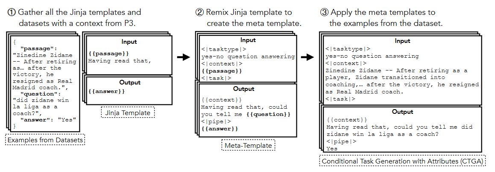

# 大模型数据集生成

## 1.Bonito

[代码](https://github.com/BatsResearch/bonito?tab=readme-ov-file)

[论文](https://arxiv.org/abs/2402.18334)

​		Bonito是一个用于条件任务生成的开源模型，它可以将未标注的文本转换为特定任务的训练数据集，用于指令微调。根据论文介绍，该模型本身是在 mistralai/Mistral-7B-v0.1 的基础上，利用包含 165 万个示例的数据集进行微调，支持多种任务类型，包括多选题回答、是非题回答、自然语言推理、主题分类等。


​		  Bonito采用未注释的文本作为输入以及任务属性，以生成指令调整数据。对于每个未注释的文本，它会生成引用该文本和目标响应的指令。然后，指令调整数据用于（进一步）微调语言模型，使其适应专业领域的任务。




### 构建带属性的条件任务生成（Conditional Task Generation with Attributes，CTGA）数据集的过程。

​		首先，从 P3（Public Pool of Prompts）中识别需要一段段落或上下文才能完成任务的数据集。确定了 CTGA 中总共包含 38 个数据集。对于每个数据集，从 P3 收集 Jinja1 模板。

​		接下来，重新混合 Jinja 模板以创建元模板。由于 P3 中的 Jinja 模板不包含任务类型，因此使用目标任务类型（例如是非问答）手动注释它们。

​		我们获得了涵盖 16 种任务类型的 323 个元模板（有关任务类型的列表，请参见表 13）。

最后，将元模板应用于数据集中的所有示例以创建 CTGA 数据集。

### 性能


针对预训练好的模型，0样本任务适应性能，针对mistral和llama2，Bonito优于None和TAPT。

>Task-Adaptive PreTraining（TAPT）是指**在第一阶段通用预训练模型的基础上，利用任务相关未标注文本继续训练**


针对微调后的模型，0样本任务适应性能，针对mistral和llama2，Bonito优于None和TAPT。

## 2.基于预训练大模型的数据集生成

[参考](https://blog.csdn.net/phyllis0065/article/details/140146632?spm=1001.2101.3001.6650.5&utm_medium=distribute.pc_relevant.none-task-blog-2%7Edefault%7EYuanLiJiHua%7EPosition-5-140146632-blog-132658756.235%5Ev43%5Epc_blog_bottom_relevance_base1&depth_1-utm_source=distribute.pc_relevant.none-task-blog-2%7Edefault%7EYuanLiJiHua%7EPosition-5-140146632-blog-132658756.235%5Ev43%5Epc_blog_bottom_relevance_base1&utm_relevant_index=8)

通过给大模型设置身份以及提示词让其根据文本生成合适的问答对。

prompt示例：

```python
#01 你是一个问答对数据集处理专家。

#02 你的任务是根据我给出的内容，生成适合作为问答对数据集的问题。

#03 问题要尽量短，不要太长。

#04 一句话中只能有一个问题。

#05 生成的问题必须宏观、价值，不要生成特别细节的问题。

#06 生成问题示例：

"""

权益型基金的特点有哪些方面？

介绍一下卡兹克。

"""

#07 以下是我给出的内容：

"""

{{此处替换成你的内容}}

"""
```

将这一步生成的问题再结合原文给gpt生成答案，这一步的提示词是：

```python
#01 你是一个问答对数据集处理专家。

#02 你的任务是根据我的问题和我给出的内容，生成对应的问答对。

#03 答案要全面，多使用我的信息，内容要更丰富。

#04 你必须根据我的问答对示例格式来生成：

"""

{"content": "基金分类有哪些", "summary": "根据不同标准，可以将证券投资基金划分为不同的种类：（1）根据基金单位是否可增加或赎回，可分为开放式基金和封闭式基金。开放式基金不上市交易（这要看情况），通过银行、券商、基金公司申购和赎回，基金规模不固定；封闭式基金有固定的存续期，一般在证券交易场所上市交易，投资者通过二级市场买卖基金单位。（2）根据组织形态的不同，可分为公司型基金和契约型基金。基金通过发行基金股份成立投资基金公司的形式设立，通常称为公司型基金；由基金管理人、基金托管人和投资人三方通过基金契约设立，通常称为契约型基金。我国的证券投资基金均为契约型基金。（3）根据投资风险与收益的不同，可分为成长型、收入型和平衡型基金。（4）根据投资对象的不同，可分为股票基金、债券基金、货币基金和混合型基金四大类。"}

{"content": "基金是什么", "summary": "基金，英文是fund，广义是指为了某种目的而设立的具有一定数量的资金。主要包括公积金、信托投资基金、保险基金、退休基金，各种基金会的基金。从会计角度透析，基金是一个狭义的概念，意指具有特定目的和用途的资金。我们提到的基金主要是指证券投资基金。"}

#05 我的问题如下：

"""

 {{此处替换成你上一步生成的问题}}

"""

#06 我的内容如下：

"""

 {{此处替换成你的内容}}

"""
```

这种输入需要经过两次输入才能实现，所以利用python脚本来自动进行，实现基本流程如下：

1.从pdf中提取文本

2.将提取的文本分割成模型能接受的最大字符数和token的形式

3.将分割后的文本储存到多个txt文件中

4，读取txt文件

4.定义prompt，参考上述两种prompt，生成问题和问答对的提示词

5.配置大模型接口

6.定义对模型提问和生成问答对的函数

7.将生成的问答对写入txt文件

[通过Langchain链接llms生成](https://blog.csdn.net/xx_nm98/article/details/141269778?utm_medium=distribute.pc_relevant.none-task-blog-2~default~baidujs_baidulandingword~default-0-141269778-blog-132658756.235^v43^pc_blog_bottom_relevance_base1&spm=1001.2101.3001.4242.1&utm_relevant_index=1)


