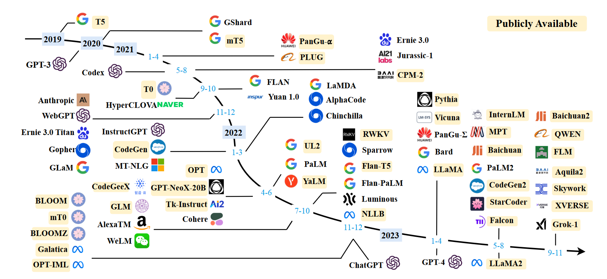

# Llms学习笔记  
## Language Model
语言模型是对一组词元序列（tokens）的概率分布的一种表示方法，假设我们有一个词元集的词汇表 $V$ 。语言模型p为每个词元序列 $x_{1},...,x_{L}$ ∈ $V$ 分配一个概率（介于0和1之间的数字）

$$
p(x_1, \dots, x_L)
$$  

语言模型也可以采用生成形式，即根据输入的词元来生成下一个词，其中下一词的选取根据目前所给的词通过神经网路计算从而采用概率最高的一词。  

$$
prompt→completion
$$

例如根据提示词生成：

$$
sky;blue;grass→green
$$  

  
## Large language Models
语言模型是根据概率论等生成新词语，2018年，随着Transformer神经网络构架的发现，大量提升了训练语言模型神经网络的样本数量，大语言模型处理自然语言的能力得到大幅度提升，正式进入大模型时代，大模型层出不穷。  
目前市面上常见的大模型有：

[!htbp]  
**Example Image**: f583c3c21be225bb988c055067f547a.jpg

